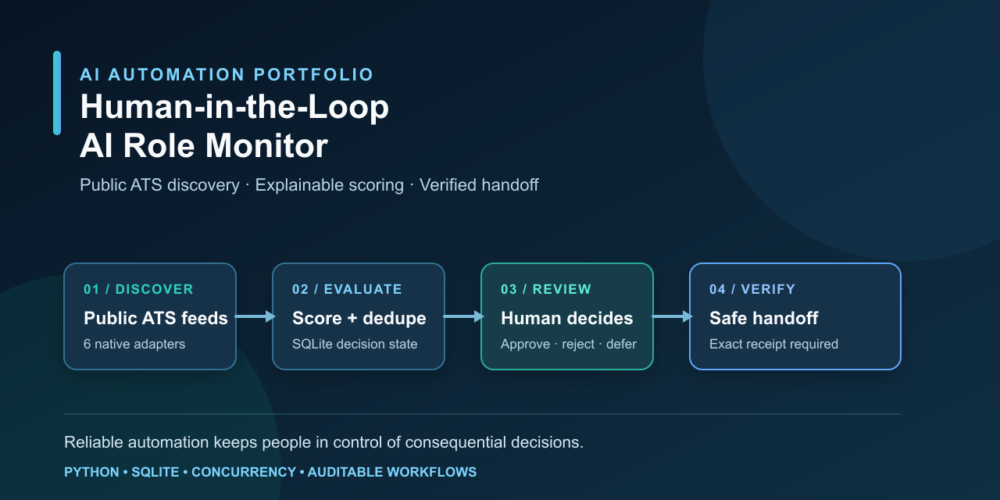
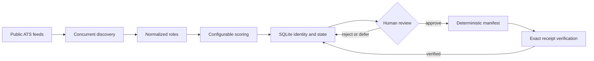

# Human-in-the-Loop AI Role Monitor

> A safe Python automation portfolio project that turns public ATS listings into a human-reviewed, auditable handoff queue for AI automation, implementation, and workflow-engineering roles.

[](pyproject.toml) [](LICENSE) [](tests)



Built to demonstrate the engineering judgment behind reliable AI-enabled automation: public-source discovery, clear decision boundaries, traceable state, and delivery verification. It is intentionally a **monitor and handoff system—not an application bot**.

**Start here:** [architecture](docs/architecture.md) · [provenance](docs/provenance.md) · [security boundaries](SECURITY.md) · [GitHub metadata](docs/github-metadata.md) · [recruiter discoverability checklist](docs/seo-checklist.md)

## What this demonstrates

- Six documented public ATS adapters: Greenhouse, Lever (global and EU), Ashby, SmartRecruiters (pagination and detail hydration), Workable, and Recruitee.
- Concurrent discovery with bounded retries and per-source failure isolation, so one unavailable career site does not discard other findings.
- Explainable, configuration-driven scoring; stable identity and deduplication; and persisted SQLite decision state.
- An explicit human decision: approve, reject, or defer before a role is eligible for handoff.
- Deterministic handoff manifests with exact receipt verification, plus atomic, redacted JSON and CSV reports.

## 60-second recruiter walkthrough

1. A scan normalizes public openings from multiple ATS providers into a common role record.
2. A transparent policy scores each role against configured terms and thresholds; the resulting queue remains reviewable rather than auto-acted on.
3. SQLite preserves identity, decisions, and audit history across rescans—changing a listing title does not silently reset a prior decision.
4. After a person approves a role, the system produces a deterministic manifest. Delivery is recognized only when the receiver returns an exact receipt for that manifest.

The result is a concrete example of human-in-the-loop automation for implementation-oriented work: automation handles repeatable collection and evidence; people retain the consequential decision.

## Quick start

Requires Python 3.11+.

```bash
python -m pip install --no-deps -e .
python -m unittest discover -s tests -v
python -m compileall -q src tests
```

Run the complete offline demonstration:

```bash
role-monitor demo --output-dir demo-output --reset
```

It creates a disposable workspace populated only with fictional employers, roles, listings, and receipts. The demo performs one clearly labelled synthetic approval, then proves that manifest and receipt verification work without contacting the network. Inspect `demo-output/reports/`, `demo-output/handoff_manifest.json`, and `demo-output/handoff_receipt.json`.

For a production-style manual flow, copy the example configuration to the ignored `config.local.json`, replace the fictional employer URLs with public careers pages, and keep each decision explicit:

```bash
role-monitor scan --config config.local.json --allow-network
role-monitor queue --config config.local.json
role-monitor review --config config.local.json ROLE_KEY approved --note "Reviewed manually"
role-monitor prepare-handoff --config config.local.json --destination output/handoff.json
```

The live `scan` command never makes a review decision. Use `role-monitor --help` and each subcommand's `--help` for the complete interface.

Live discovery is deliberately opt-in and requires an explicit `--allow-network` flag. Use only public sources, honor provider terms and rate limits, and review discovered roles before any handoff.

If a process stops after delivery begins, first reconcile the downstream task system. Preserve and acknowledge its exact receipt when possible. Only when a stable-role-key upsert is confirmed safe should an operator release the stranded claim for retry:

```bash
role-monitor recover-handoff \
  --config config.local.json \
  --manifest output/handoff.json \
  --confirm-downstream-reconciled
```

## Evidence an operator can inspect

| Stage | Artifact or evidence | Why it matters |
| --- | --- | --- |
| Discovery | Normalized role records and structured per-source failures | Shows partial success instead of hiding a broken feed. |
| Evaluation | Configurable score and review queue | Makes ranking criteria inspectable and reversible. |
| State | SQLite roles, decisions, and audit events | Preserves review decisions while listings change on later scans. |
| Delivery | Deterministic handoff manifest and exact receipt | Prevents partial, stale, or mismatched acknowledgements from being treated as delivered. |
| Reporting | Atomic, redacted JSON and CSV reports | Produces shareable run evidence while keeping reviewer notes in the private SQLite state. |

## Architecture



See the [full architecture](docs/architecture.md) for module responsibilities and reliability decisions.

## Supported public ATS sources

| Provider | Support | Documentation |
| --- | --- | --- |
| Greenhouse | Native public job-board adapter | [Job Board API](https://developers.greenhouse.io/job-board.html) |
| Lever | Native public postings adapter | [Postings API](https://github.com/lever/postings-api) |
| Ashby | Native public job-postings adapter | [Public Job Posting API](https://developers.ashbyhq.com/docs/public-job-posting-api) |
| SmartRecruiters | Native public postings adapter with pagination | [Public Posting API](https://developers.smartrecruiters.com/docs/endpoints) |
| Workable | Native public published-jobs adapter | [Published jobs endpoint](https://help.workable.com/hc/en-us/articles/115012771647-Using-the-Workable-API-to-create-a-careers-page) |
| Recruitee | Native public careers-site adapter | [Careers Site API](https://docs.recruitee.com/reference/intro-to-careers-site-api) |
| Other career pages | Generic HTML / JSON-LD fallback | **Incomplete by design**; dynamic sites can hide listings. |

The project uses documented public endpoints and synthetic fixtures. Provider schemas, availability, and terms can change; see [provenance](docs/provenance.md).

## Safety boundaries

- Version 1 never submits applications, sends credentials, or automates a consequential decision.
- Human approval is required before a role can be handed off; rejected and deferred decisions are retained separately.
- Configuration rejects authentication-shaped fields, and persisted external errors are bounded and redacted.
- Only an exact receipt for the current manifest can complete delivery; invalid or partial receipts leave state unchanged.
- Concurrent delivery is blocked by a durable claim; crash recovery requires explicit downstream reconciliation rather than an automatic timeout takeover.
- A first complete-feed miss pauses review and handoff eligibility; retirement requires two consecutive complete misses, and roles not seen for seven days must be refreshed before review or handoff.
- Telegram is deferred to a later release. If added, it will use environment-provided credentials and mocked tests—never committed keys.

Read the complete [security policy and operating boundaries](SECURITY.md).

## Limitations

- Generic career-page parsing is a best-effort fallback, not a full browser automation solution.
- The system cannot guarantee that a third-party listing is accurate, current, or still accepting candidates.
- The standard-library HTTP transport validates resolved and redirected targets before each request, but it does not pin the validated IP through the TLS connection; configured hosts are assumed not to use DNS rebinding.
- Scoring is an aid to review, not a fit prediction or hiring decision.
- Operators remain responsible for source terms, request rates, and their own follow-up decisions.

## Tests and quality checks

The test suite covers provider-domain validation, malformed responses, retry behavior, concurrent failure isolation, scoring policy, stable identity, preserved review decisions, report redaction/atomicity, and exact handoff receipts.

```bash
python -m unittest discover -s tests -v
python -m compileall -q src tests
```

## Roadmap

- [x] Ship an offline `role-monitor demo` workflow with synthetic reports, manifest, and receipt.
- [ ] Add optional Telegram notifications with environment-only credentials and mocked tests.
- [ ] Expand documented public-feed coverage while preserving the same review and verification boundary.

## Contributing

Contributions should improve documented public-feed compatibility, reliability, accessibility, or evidence quality. See [CONTRIBUTING.md](CONTRIBUTING.md); all fixtures must remain fictional.

## License

MIT. See [LICENSE](LICENSE).
