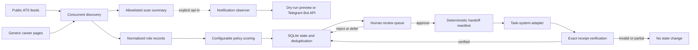

# Architecture

The project separates discovery from decisions and delivery. That boundary keeps network failures and ranking changes from silently becoming external actions.

## Module boundaries

| Module | Responsibility |
| --- | --- |
| `feeds` | Recognize documented ATS domains and normalize already-fetched payloads. |
| `http` | Fetch public pages with bounded retries and injectable transports. |
| `discovery` | Run sources concurrently while isolating per-source failures. |
| `policy` | Apply transparent, configuration-driven scoring rules. |
| `store` | Preserve stable role identity, review decisions, audit events, and delivery state in SQLite. |
| `review` | Expose the explicit human decision boundary. |
| `handoff` | Build atomic manifests and require exact receipts before acknowledging delivery. |
| `reports` | Produce deterministic, redacted CSV and JSON artifacts. |
| `notifications` | Build bounded, provider-neutral, summary-only event messages and offline previews. |
| `telegram` | Load environment-only credentials and send plain text through a fixed host with bounded retries. |
| `cli` | Coordinate safe commands and the offline demonstration. |

## Reliability decisions

- Stable provider IDs take precedence over mutable job titles for deduplication.
- Tracking parameters and fragments do not create new role identities; provider identity parameters such as Greenhouse `gh_jid` are preserved.
- Only transient transport failures are retried; ordinary client errors fail immediately.
- An exception from one source becomes a structured failure record instead of aborting the run.
- Generic HTML results are treated as incomplete because dynamic career pages may hide listings.
- The first absence from a successful, complete native-source scan pauses review and handoff eligibility. A role is retired only after two consecutive complete misses; failures and generic partial scans never infer closure. Rediscovery clears the miss count without discarding a still-valid human decision.
- Active roles last seen more than seven days ago are unavailable for review or handoff until a fresh scan observes them. Prepared pending manifests containing an unavailable role are invalidated.
- Rescans update public listing fields without resetting a person's decision.
- Approval freezes an immutable public-field snapshot, so a later title or URL change cannot enter a handoff without having been part of the human-reviewed record.
- Only the latest registered manifest can be acknowledged; exact role and URL coverage is required.
- A durable SQLite delivery claim prevents concurrent adapter calls. It never expires automatically because a slow but active call must not be taken over.
- After a crash, the operator first reconciles downstream state. An exact retained receipt can be acknowledged directly; otherwise the claim can be released only with explicit confirmation before an idempotent retry. Adapters must upsert by stable role key because recovery may repeat a call whose receipt was lost.
- Notifications observe an already completed scan at the CLI boundary. They never mutate review or handoff state, and notification failure cannot roll back persisted scan results or reports.
- Telegram is disabled unless an operator selects dry-run or live-send mode. Live credentials are loaded before discovery, but the summary is sent only after scan persistence and report generation finish.
- Telegram delivery is at-least-once: a retry after an ambiguous timeout may duplicate a digest, so every deterministic template includes a stable scan ID.
